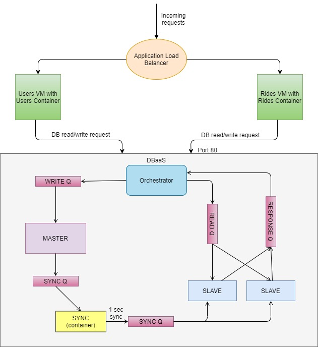

<h1>CC-Project-DBaaS</h1>

<h2> Architecture</h2>
</img>

<b>Note:</b> Please read the <a href="https://github.com/r-i-c-h-a/CC-Project-DBaaS/blob/master/Report/CC_0230_0688_1002_1799-ReportTemplateCloudComputing.pdf">report</a> for a better insight on the architecture.

<h2> Instructions to run the code</h2>
<h3> Rides Instance </h3>
1. Start the AWS Rides Instance 
2. <code>cd rides-test/rides</code> 
3. <code>sudo docker system prune --volumes</code> 
4. <code>sudo docker-compose up --build</code> 

<h3> Users Instance</h3>
1. Start the AWS Users Instance 
2. <code>cd users-test/users</code> 
3. <code>sudo docker system prune --volumes</code> 
4. <code>sudo docker-compose up --build</code> 

<h3> DBaaS Instance</h3>
1. Start the AWS DBaaS Instance 
2. <code>cd project-test/project</code> 
3. <code>sudo docker rm -f $(sudo docker ps -aq)</code> 
4. <code>sudo docker system prune --volumes</code> 
5. <code>sudo docker-compose up --build</code> 
